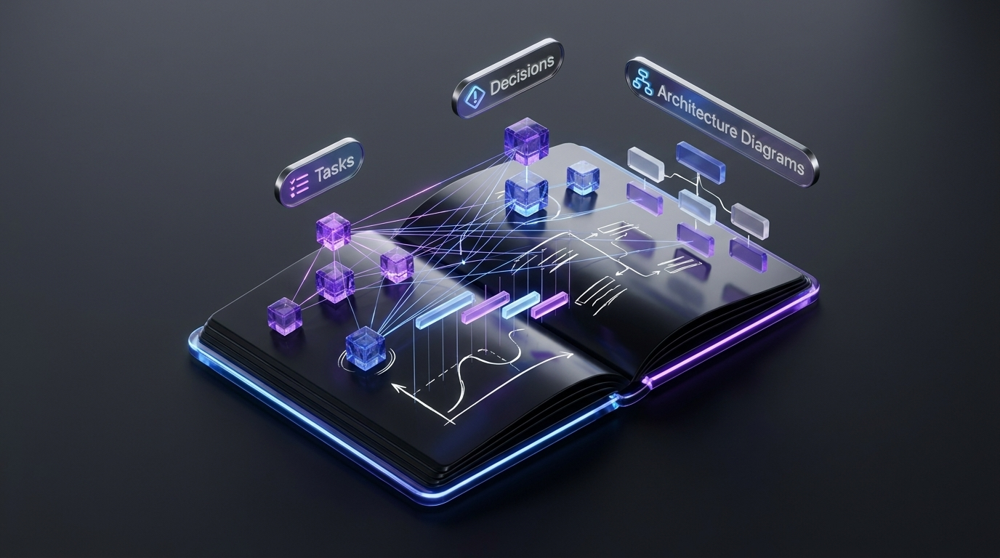

# Running On-Device RAG Embeddings with WebWorkers and ONNX Inside a Markdown Notebook

*How H.A.N. delivers sub-50ms local semantic search and private AI without sending your vault to the cloud.*

---





Retrieval-Augmented Generation (RAG) has transformed how we interact with personal knowledge. Asking an AI questions like *"What was the rationale behind our database migration?"* or *"Summarize all open tasks for project Apollo"* feels like having a personal research assistant.

However, almost every existing RAG solution requires sending your entire private document database to an external cloud vector database (like Pinecone, Qdrant, or OpenAI embeddings). For developers, architects, and privacy-conscious users, **uploading personal notes, confidential project specs, and passwords to third-party servers is a dealbreaker**.

When building **[H.A.N. (Hierarchical Adaptive Notebook)](https://github.com/bishoku/han-notes-app)**, we set an uncompromising requirement: **RAG embeddings, vector indexing, and semantic search must run 100% locally on the client machine — with zero server dependencies.**

Here is the technical blueprint of how we accomplished this in the browser and desktop app using **WebWorkers**, **Transformers.js / ONNX Runtime Web**, and **IndexedDB**.

---

## 🏗️ The Local RAG Pipeline

Running deep learning models inside client applications presents two major challenges:
1. **Main Thread Blocking**: Tokenization and matrix multiplication in neural networks consume heavy CPU cycles, which can freeze the UI and drop frame rates.
2. **Model Weight Footprint**: Embedding models can easily exceed 500MB, resulting in unacceptable load times.

To overcome these hurdles, we designed a multi-tiered architecture:

```
┌──────────────────────────────────────────────────────────────┐
│                    Main React UI Thread                      │
│     Editor · Search View · AI Chat Drawer · UI Stores        │
└──────────────┬───────────────────────────────▲───────────────┘
               │ PostMessage (Batched Chunks)  │ Semantic Vectors
               ▼                               │
┌──────────────────────────────────────────────┴───────────────┐
│              Dedicated Background WebWorker                  │
│  ┌────────────────────────────────────────────────────────┐  │
│  │   Transformers.js (ONNX Runtime Web - Quantized INT8)  │  │
│  │   Primary: multilingual-e5-small (100+ languages)      │  │
│  │   Fallback: all-MiniLM-L6-v2 (Offline local bundle)    │  │
│  └────────────────────────────────────────────────────────┘  │
└──────────────┬───────────────────────────────────────────────┘
               │ Store Chunks & Vector Float32Arrays
               ▼
┌──────────────────────────────────────────────────────────────┐
│             Local Vector Store (Browser IndexedDB)           │
│        Tables: Chunks · Vectors · Note Hashes · Metadata     │
└──────────────────────────────────────────────────────────────┘
```

---

## ⚡ 1. Offloading Inference to a Dedicated WebWorker

To keep typing in the CodeMirror editor buttery smooth at 60 FPS, the entire machine learning runtime is isolated inside `embedding.worker.ts`:

```typescript
// embedding.worker.ts
import { pipeline, env } from '@xenova/transformers';

env.allowLocalModels = true;
env.allowRemoteModels = true;
env.useBrowserCache = true;

let embedder: any = null;

async function getEmbedder() {
  if (!embedder) {
    embedder = await pipeline('feature-extraction', 'Xenova/multilingual-e5-small', {
      quantized: true, // Uses 8-bit quantized ONNX model (~30MB)
    });
  }
  return embedder;
}

self.onmessage = async (e: MessageEvent) => {
  const { type, id, texts, text } = e.data;

  if (type === 'EMBED_BATCH') {
    const model = await getEmbedder();
    const results: number[][] = [];

    for (const chunk of texts) {
      // E5 models require 'passage: ' prefix for document indexing
      const output = await model(`passage: ${chunk}`, {
        pooling: 'mean',
        normalize: true,
      });
      results.push(Array.from(output.data as Float32Array));
    }

    self.postMessage({ type: 'EMBED_BATCH_DONE', id, vectors: results });
  } else if (type === 'EMBED_QUERY') {
    const model = await getEmbedder();
    // 'query: ' prefix for user search prompts
    const output = await model(`query: ${text}`, {
      pooling: 'mean',
      normalize: true,
    });
    self.postMessage({
      type: 'EMBED_QUERY_DONE',
      id,
      vector: Array.from(output.data as Float32Array),
    });
  }
};
```

---

## 📦 2. Dual-Model Strategy: Multilingual + Offline Bundling

Not all users have high-speed internet at all times:
- **Preferred Model (`Xenova/multilingual-e5-small`)**: Downloaded once and cached via CacheStorage. Excellent for Turkish, English, German, and 100+ languages.
- **Offline Fallback (`Xenova/all-MiniLM-L6-v2`)**: Bundled directly into the app's `public/models/` distribution directory. If the app is launched in a secure offline intranet or on an airplane, it immediately switches to the local bundle with zero network requests.

---

## 💾 3. Fast Vector Storage in Client IndexedDB

Once vectors are generated (384-dimensional dense `Float32Array` vectors), they are stored locally in **IndexedDB**. 

When a user writes or updates a note:
1. The document is split into semantic paragraphs/chunks (200–500 tokens with 50-token overlap).
2. A SHA-256 hash of the note content is checked; unchanged notes are skipped.
3. Modified chunks are embedded in the background worker and saved to IndexedDB.

### In-Browser Cosine Similarity Calculation
When a search query or AI prompt is submitted, the query is embedded into a 384-d vector, and dot-product cosine similarity is computed across all vault chunks in WebAssembly / SIMD:

$$\text{similarity} = \sum_{i=1}^{n} A_i \cdot B_i$$

Because vectors are L2-normalized upon creation, the cosine similarity simplifies to a single vectorized dot product:

```typescript
function cosineSimilarity(vecA: Float32Array, vecB: Float32Array): number {
  let dotProduct = 0;
  for (let i = 0; i < vecA.length; i++) {
    dotProduct += vecA[i] * vecB[i];
  }
  return dotProduct;
}
```

On a vault with 2,000 notes and 10,000 chunks, scanning all vectors takes **less than 15 milliseconds** on an Apple M-series or modern x86 CPU.

---

## 🧠 4. Clean Extraction of LLM `<think>` Reasoning

Modern reasoning models (like DeepSeek-R1, Qwen 2.5 Max, and o1/o3-mini) output extensive chain-of-thought tokens before providing the final answer. 

In H.A.N., our core Rust/WASM parser (`parse_reasoning_blocks`) intercepts these tokens during live streaming:

```rust
// han-core/src/lib.rs
pub fn parse_reasoning_blocks(raw: &str) -> ParsedReasoningOutput {
    // Strips <think>...</think>, <|thought|>...<|endofthought|>
    // Separates scratchpad thoughts from the clean user markdown
}
```

The UI displays the model's internal thinking process in a collapsed **"Thinking Process"** card, leaving the final note or answer clean and distraction-free.

---

## 🎯 Results & Takeaways

By keeping the entire RAG pipeline inside the client:
- **Total Privacy**: Notes never leave the user's computer for vectorization.
- **Zero Cloud Costs**: No external vector DB subscriptions ($0/month).
- **Sub-50ms Latency**: Hybrid keyword + vector search executes instantaneously.
- **Works Offline**: Full semantic search works on a flight without Wi-Fi.

---

### Try H.A.N. in Your Browser
Experience local-first AI and Markdown notes right now:
- 🌐 **Live Web Demo:** [https://bishoku.github.io/han-notes-app/](https://bishoku.github.io/han-notes-app/)
- ⭐ **GitHub Repo:** [https://github.com/bishoku/han-notes-app](https://github.com/bishoku/han-notes-app)
