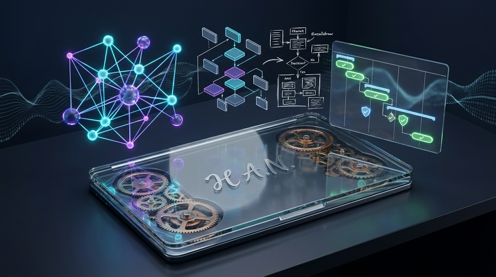

# Building a Zero-Knowledge P2P Sync Engine with WebRTC and Cloudflare Durable Objects

*How we engineered instant, accountless, end-to-end encrypted notes synchronization between desktop and mobile with zero cloud storage costs.*

---



---

The local-first software movement represents one of the most exciting shifts in modern application design. By storing data locally in plain text or SQLite databases on the user's own device, local-first applications offer unmatched speed, offline resilience, and guaranteed data ownership. There are no spinners, no offline errors, and no risk of a third-party startup shutting down and taking your life's work with it.

Yet, building local-first software introduces what many engineers consider the final boss of application architecture: **Multi-device synchronization.**

When designing **[H.A.N. (Hierarchical Adaptive Notebook)](https://github.com/bishoku/han-notes-app)** — a local-first, privacy-focused Markdown notebook — we wanted users to seamlessly edit notes on their desktop computer and continue writing on their smartphone or tablet. But we refused to compromise on our foundational ethos:

1. **No User Accounts**: No logins, email verifications, passwords, or OAuth providers.
2. **Zero-Knowledge Privacy**: User notes, titles, tags, and tasks must never touch a server in unencrypted form.
3. **No Cloud Storage Intermediaries**: No hosted databases (PostgreSQL, Supabase, CouchDB) storing copies of user vaults.
4. **$0 Infrastructure Bill**: The synchronization architecture must run perpetually within free-tier serverless limits.

To achieve this, we designed and built a **decentralized, peer-to-peer (P2P) synchronization engine** powered by **WebRTC DataChannels**, the **Web Crypto API (AES-GCM-256)**, and an ephemeral signaling relay running on **Cloudflare Workers with Durable Objects**.

Here is a comprehensive deep dive into the architecture, the cryptographic protocols, the packet chunking algorithms, and the lessons we learned along the way.

---

## 1. The High-Level Architecture: Decoupling Data from Signaling

The fundamental mistake many developers make when designing sync systems is treating synchronization as a database problem. In reality, **synchronization is a transport problem.**

If Device A has a newer version of a note and Device B wants it, you do not need an intermediary database to store that note for eternity. You only need a secure, direct pipe between the two devices to stream the delta.

WebRTC (Web Real-Time Communication) provides exactly this through its **`RTCDataChannel`** API — an encrypted, peer-to-peer transport protocol running over SCTP (Stream Control Transmission Protocol) wrapped inside DTLS (Datagram Transport Layer Security).

However, WebRTC cannot establish a connection out of thin air. Before two browsers can talk directly, they must exchange session descriptions (SDP offers and answers) and network routing candidates (ICE candidates). This negotiation phase is known as **signaling**.

```
┌─────────────────────────────────────────────────────────────────────────────────┐
│                          1. Ephemeral Signaling Phase                           │
└─────────────────────────────────────────────────────────────────────────────────┘
      Desktop (Host)                                         Mobile (Peer)
             │                                                     │
             │───────► WSS Connect (/room/xyz) ◄───────────────────│
             │           Cloudflare Durable Object                 │
             │               (SQLite Relay)                        │
             │                                                     │
             │─── Encrypted SDP Offer ────────────────────────────►│
             │◄── Encrypted SDP Answer ────────────────────────────│
             │─── ICE Candidates ◄────────────────────────────────►│
             │                                                     │
             ▼                                                     ▼
┌─────────────────────────────────────────────────────────────────────────────────┐
│             2. WebRTC DataChannel Opened (Signaling WebSocket Dropped)          │
└─────────────────────────────────────────────────────────────────────────────────┘
      Desktop (Host)                                         Mobile (Peer)
             │                                                     │
             │ ◄=================================================► │
             │             Direct P2P WebRTC DataChannel           │
             │             (16 KiB Framed Packets, E2EE)           │
             │                                                     │
             │─── Note Manifest Exchange (SHA-256 Diffing) ───────►│
             │─── Encrypted Delta Streaming (AES-GCM-256) ────────►│
             │◄── Soft-Delete Tombstones & Conflict Sync ──────────│
```

### The "Drop on Open" Principle

Traditional collaborative apps keep persistent WebSocket connections open to their application servers for the entire duration of a user session. This model consumes significant server memory and requires complex auto-scaling infrastructure.

H.A.N. employs a strict **"Drop on Open"** lifecycle:
1. The host generates an ephemeral room on our Cloudflare Worker and connects via WebSocket.
2. The peer joins the room and exchanges SDP/ICE messages over the WebSocket.
3. The moment the WebRTC `RTCDataChannel.onopen` event fires, **both devices immediately sever the WebSocket connection to Cloudflare.**

From that millisecond onward, all data transfers, note diffs, and cryptographic verifications flow 100% peer-to-peer across the local Wi-Fi or public internet. The signaling server's memory is instantly freed, keeping our cloud compute costs at exactly **$0.00**.

---

## 2. Zero-Knowledge Key Exchange: The URL Hash Fragment Trick

How do two devices establish a shared encryption key without an account system or a centralized key management service (KMS)?

If the signaling server could see the encryption key, it wouldn't be a zero-knowledge system. We needed a mechanism where the decryption key travels strictly from screen to camera without ever appearing in an HTTP request header, query parameter, or server log.

The answer lies in **RFC 3986 (Uniform Resource Identifier Specification)** and the mechanics of the URL **Hash Fragment** (`#`).

### Step 1: Client-Side Key Generation

When the user opens the P2P Sync modal on their desktop computer, H.A.N. leverages the browser's native **Web Crypto API** to generate a cryptographically random, 256-bit AES-GCM symmetric key:

```typescript
// Generate a non-extractable, high-entropy 256-bit symmetric key
export async function generateSyncKey(): Promise<CryptoKey> {
  return await crypto.subtle.generateKey(
    { name: 'AES-GCM', length: 256 },
    true, // Extractable so we can export to base64url for QR
    ['encrypt', 'decrypt']
  );
}

// Export the key as URL-safe base64
export async function exportKeyToBase64(key: CryptoKey): Promise<string> {
  const rawKey = await crypto.subtle.exportKey('raw', key);
  return bytesToBase64Url(new Uint8Array(rawKey));
}
```

### Step 2: Constructing the Hash URL

Next, H.A.N. generates a unique ephemeral room identifier (e.g., `sync-8f92-4d1a`) and constructs a pairing link:

```
https://bishoku.github.io/han-notes-app/#sync=sync-8f92-4d1a&key=dGhpcy1pcy1hLXNhbXBsZS0yNTYtYml0LWtleQ&role=peer
```

Notice where the parameters reside: **after the `#` symbol**.

According to the HTTP specification, web browsers **never** transmit the URI fragment to the web server when fetching a page. When a mobile device opens this URL, GitHub Pages (or whatever host serves the static bundle) only sees a request for `GET /han-notes-app/`. The room ID and the 256-bit encryption key exist solely in the mobile device's client-side browser runtime.

```
┌─────────────────────────────────────────────────────────────┐
│                     Desktop Screen                          │
│                                                             │
│       ┌──────────────────────┐                              │
│       │  ████████  ████████  │    QR Code encodes:          │
│       │  █ ▄▄▄ █    █ ▄▄▄ █  │    https://app/#sync=...     │
│       │  █▄▄▄█ █    █▄▄▄█ █  │                              │
│       │  ████████  ████████  │                              │
│       └──────────────────────┘                              │
└───────────────────▲─────────────────────────────────────────┘
                    │ Optical Transfer (Air-Gapped)
                    │ Key never touches any network interface!
┌───────────────────▼─────────────────────────────────────────┐
│                      Mobile Camera                          │
│                                                             │
│  1. Camera reads QR URL                                     │
│  2. JavaScript parses window.location.hash                  │
│  3. Key imported into crypto.subtle in memory               │
│  4. Room ID sent to Signaling Server (Key stays private)    │
└─────────────────────────────────────────────────────────────┘
```

### Step 3: End-to-End Encryption Over the Wire

Every payload transmitted over the DataChannel is encrypted using authenticated AES-GCM with a freshly generated 12-byte initialization vector (`IV`) for each message:

```typescript
export async function encryptPayload(data: unknown, key: CryptoKey): Promise<Uint8Array> {
  const jsonStr = JSON.stringify(data);
  const encoded = new TextEncoder().encode(jsonStr);
  const iv = crypto.getRandomValues(new Uint8Array(12)); // 96-bit unique IV

  const ciphertext = await crypto.subtle.encrypt(
    { name: 'AES-GCM', iv },
    key,
    encoded
  );

  // Prepend IV to ciphertext: [ 12B IV ][ Ciphertext + 16B Auth Tag ]
  const result = new Uint8Array(iv.byteLength + ciphertext.byteLength);
  result.set(iv, 0);
  result.set(new Uint8Array(ciphertext), iv.byteLength);
  return result;
}
```

Because AES-GCM includes an authentication tag, any tampering, bit flips, or data corruption over the wire results in an immediate cryptographic rejection before the data is deserialized.

---

## 3. The 64 KiB Trap: Packet Chunking and Backpressure

With our cryptographic handshake in place, our initial sync tests between two MacBooks worked like magic. But the moment we tested synchronizing a realistic vault with large Markdown documents, embedded vector sketches (Excalidraw/YADA), and full-vault manifests, the transfer crashed with this infamous runtime error:

```
Uncaught DOMException: Failed to execute 'send' on 'RTCDataChannel':
Trying to send message larger than max-message-size
```

### The Anatomy of the WebRTC Message Limit

WebRTC DataChannels run over the **SCTP** protocol. While the WebRTC specification theoretically supports large messages, browser implementations (specifically Chromium and Safari) enforce strict limits on the maximum payload size that can be passed to a single `channel.send()` invocation.

- In older Safari versions, this limit was strictly **64 KiB (65,536 bytes)**.
- In Chromium, the limit is typically **262,144 bytes**.
- Exceeding the platform limit immediately aborts the DataChannel with an unrecoverable exception.

If a user has a note containing a 500 KB embedded diagram or a manifest listing 2,000 files, a single `send()` call will crash the sync session.

### The Solution: An 8-Byte Binary Framing Protocol

To eliminate this limit forever, we built an application-layer packet fragmentation and reassembly engine (`src/services/sync/chunking.ts`).

Every encrypted binary payload is divided into safe **16 KiB (16,384 bytes)** chunks. Each chunk is prefixed with an 8-byte binary framing header:

```
 0                   1                   2                   3
 0 1 2 3 4 5 6 7 8 9 0 1 2 3 4 5 6 7 8 9 0 1 2 3 4 5 6 7 8 9 0 1
+-+-+-+-+-+-+-+-+-+-+-+-+-+-+-+-+-+-+-+-+-+-+-+-+-+-+-+-+-+-+-+-+
|                       Message ID (uint32)                     |
+-+-+-+-+-+-+-+-+-+-+-+-+-+-+-+-+-+-+-+-+-+-+-+-+-+-+-+-+-+-+-+-+
|       Chunk Index (uint16)    |      Total Chunks (uint16)    |
+-+-+-+-+-+-+-+-+-+-+-+-+-+-+-+-+-+-+-+-+-+-+-+-+-+-+-+-+-+-+-+-+
|                      Chunk Data (0..16 KiB)                   |
|                               ...                             |
+-+-+-+-+-+-+-+-+-+-+-+-+-+-+-+-+-+-+-+-+-+-+-+-+-+-+-+-+-+-+-+-+
```

Here is the chunk slicing implementation:

```typescript
const CHUNK_SIZE = 16 * 1024; // 16 KiB safe transmission unit
const HEADER_SIZE = 8;        // 4B msgId + 2B index + 2B total

export function chunkPayload(payload: Uint8Array, messageId: number): Uint8Array[] {
  const totalChunks = Math.ceil(payload.byteLength / CHUNK_SIZE);
  const chunks: Uint8Array[] = [];

  for (let i = 0; i < totalChunks; i++) {
    const start = i * CHUNK_SIZE;
    const end = Math.min(start + CHUNK_SIZE, payload.byteLength);
    const slice = payload.subarray(start, end);

    const packet = new Uint8Array(HEADER_SIZE + slice.byteLength);
    const view = new DataView(packet.buffer, packet.byteOffset, packet.byteLength);

    view.setUint32(0, messageId, false);  // 4 bytes: Message ID
    view.setUint16(4, i, false);          // 2 bytes: Chunk Index
    view.setUint16(6, totalChunks, false);// 2 bytes: Total Chunks
    packet.set(slice, HEADER_SIZE);

    chunks.push(packet);
  }

  return chunks;
}
```

### Deinterleaving and Asynchronous Reassembly

On the receiving end, packets might arrive out of order, or packets from a small control message might arrive interleaved between chunks of a massive file transfer.

Our `MessageReassembler` uses a stateful map keyed by `messageId`. As chunks arrive, it validates the packet headers, stores them in their designated index slots, and emits the assembled payload only when all chunks have arrived:

```typescript
export class MessageReassembler {
  private inFlight = new Map<number, { chunks: (Uint8Array | null)[]; received: number; total: number }>();

  public processPacket(packet: Uint8Array): Uint8Array | null {
    if (packet.byteLength < HEADER_SIZE) return null;

    const view = new DataView(packet.buffer, packet.byteOffset, packet.byteLength);
    const messageId = view.getUint32(0, false);
    const index = view.getUint16(4, false);
    const total = view.getUint16(6, false);
    const chunkData = packet.subarray(HEADER_SIZE);

    let entry = this.inFlight.get(messageId);
    if (!entry) {
      entry = { chunks: new Array(total).fill(null), received: 0, total };
      this.inFlight.set(messageId, entry);
    }

    if (!entry.chunks[index]) {
      entry.chunks[index] = chunkData;
      entry.received++;
    }

    // All chunks received? Reassemble in proper sequence!
    if (entry.received === entry.total) {
      this.inFlight.delete(messageId);
      const totalBytes = entry.chunks.reduce((acc, c) => acc + (c?.byteLength || 0), 0);
      const fullPayload = new Uint8Array(totalBytes);
      let offset = 0;
      for (const chunk of entry.chunks) {
        if (chunk) {
          fullPayload.set(chunk, offset);
          offset += chunk.byteLength;
        }
      }
      return fullPayload;
    }

    return null;
  }
}
```

### Flow Control and Backpressure Management

Slicing messages into 16 KB frames solved the packet size exception, but another obstacle quickly emerged: **Buffer Flooding**.

When synchronizing 50 MB of notes, calling `channel.send()` in a tight synchronous loop quickly fills the browser's underlying SCTP outbound buffer. When `channel.bufferedAmount` exceeds the browser's internal limit, messages are dropped, or the browser tab freezes under extreme memory pressure.

We resolved this by implementing **Backpressure Flow Control**:

```typescript
export async function sendWithBackpressure(
  channel: RTCDataChannel,
  chunks: Uint8Array[]
): Promise<void> {
  const HIGH_WATERMARK = 128 * 1024; // Pause at 128 KiB buffer
  const LOW_WATERMARK = 64 * 1024;   // Resume when buffer drains to 64 KiB

  channel.bufferedAmountLowThreshold = LOW_WATERMARK;

  for (const chunk of chunks) {
    // If the outbound buffer is congested, wait for the low watermark event
    if (channel.bufferedAmount > HIGH_WATERMARK) {
      await new Promise<void>((resolve) => {
        const onLow = () => {
          channel.removeEventListener('bufferedamountlow', onLow);
          resolve();
        };
        channel.addEventListener('bufferedamountlow', onLow);
      });
    }

    channel.send(chunk);
  }
}
```

With chunking and backpressure working harmoniously, H.A.N. can transfer gigabytes of notes, PDFs, and embedded sketches across mobile devices smoothly with minimal RAM usage.

---

## 4. State Synchronization: Conflict Resolution and the Tombstone Pattern

Once a reliable, encrypted binary transport channel is active, how do we synchronize note content between two asynchronous devices without losing edits?

While full CRDTs (Conflict-free Replicated Data Types) like Yjs or Automerge are outstanding for character-by-character collaborative text editors, applying CRDT models to an entire filesystem of Markdown files introduces significant metadata bloat. For personal note-taking, a deterministic, **Delta-Manifest + Tombstone System** provides optimal performance and simplicity.

### Step 1: Manifest Exchange

Instead of sending every note across the network, both devices exchange a compact, encrypted **Manifest**:

```typescript
interface NoteManifestEntry {
  id: string;          // Relative path, e.g. "Work/Architecture.md"
  updatedAt: number;   // Epoch millisecond timestamp
  contentHash: string; // SHA-256 hash of plaintext content
  deletedAt?: number;  // Deletion timestamp (if deleted)
}
```

By computing and comparing SHA-256 hashes of note contents:
- If `local.contentHash === remote.contentHash`, the note is identical. **Zero bytes are transferred.**
- If `local.updatedAt < remote.updatedAt`, the local device requests the newer version from the peer.
- If `local.updatedAt > remote.updatedAt`, the local device sends its newer version to the peer.

### Step 2: The "Resurrection Bug" and Soft-Delete Tombstones

A notorious pitfall in distributed note-taking is the **Resurrection Bug**:
1. User creates `Project.md` on Desktop.
2. User syncs Desktop and Phone. Both have `Project.md`.
3. User deletes `Project.md` on Phone.
4. One week later, User syncs Desktop and Phone again.
5. A naive sync system observes that Desktop has `Project.md` while Phone does not. It concludes that Phone is missing the note and transmits it back to the phone!

The deleted note has been resurrected from the dead.

H.A.N. solves this definitively using **Soft-Delete Tombstones**:
- When a user deletes a note, H.A.N. does not simply wipe the file from disk; it records a tombstone entry in a local metadata store (`.han_sync_metadata.json`):
  ```json
  {
    "Work/Project.md": {
      "deleted": true,
      "deletedAt": 1725451200000
    }
  }
  ```
- During synchronization, Device A transmits its tombstones along with its active notes.
- If Device B possesses `Work/Project.md` with an `updatedAt` timestamp *earlier* than the tombstone's `deletedAt`, Device B confirms that the file was deleted after its last edit and purges its local copy.
- Conversely, if Device B modified `Work/Project.md` *after* the deletion timestamp, the newer edit takes precedence, and the note is kept.

### Step 3: Non-Destructive Conflict Forks

What happens if the user edits the exact same note on both their laptop and phone while flying on an airplane without an internet connection?

When timestamps diverge and contents do not match, **silent overwrites are unacceptable**. H.A.N. performs a non-destructive conflict fork:
- The remote note is written to disk with a conflict timestamp suffix:
  `Work/Project (Conflict 2026-09-04-154500).md`
- The local version remains untouched.
- A notification prompts the user to review both versions side-by-side using H.A.N.'s built-in Git visual diff viewer.

No user idea or paragraph is ever overwritten or lost.

---

## 5. Storage Asymmetry: Bridging Desktop Disks and Mobile IndexedDB

H.A.N. runs across multiple host environments:
- **Desktop**: Runs as a lightweight macOS/Windows app via **Tauri & Rust**, writing raw `.md` files directly to the filesystem, or in Chromium via the **File System Access API (`showDirectoryPicker`)**.
- **Mobile / Tablet**: Runs as an offline-first **Progressive Web App (PWA)** in iOS Safari or Android Chrome, where browser sandboxes forbid arbitrary filesystem access.

To ensure the sync engine operates identically across all environments, we implemented an isomorphic abstraction layer called **`SyncStorageAdapter`**.

```typescript
export interface SyncStorageAdapter {
  getManifest(): Promise<NoteManifestEntry[]>;
  readNote(id: string): Promise<CanonicalNote | null>;
  writeNote(note: CanonicalNote): Promise<void>;
  deleteNote(id: string): Promise<void>;
  applyTombstone(id: string, deletedAt: number): Promise<void>;
}
```

On Desktop, `SyncStorageAdapter` operates against real directories on disk. On mobile, it transparently maps calls to a high-capacity **IndexedDB** database (`han_notes_db`). When a note arrives over WebRTC, the adapter abstracts away the underlying storage medium, ensuring the sync protocol remains completely platform-agnostic.

---

## 6. The UI Reactivity Trap: EventBus and Cross-Tab Invalidation

Building the networking layer is only half the battle. A subtle frontend bug emerged during initial testing:

> *When 20 notes were updated via WebRTC background workers, the files were correctly saved into IndexedDB, but the open note editor on the mobile screen still displayed stale content until the user manually refreshed the browser tab!*

In React and Zustand applications, updating an underlying database (like IndexedDB or disk) does not automatically trigger a re-render of components subscribed to active note memory buffers.

To fix this, we connected our sync engine to a global decoupled **EventBus** and browser **`BroadcastChannel`**:

```typescript
// When a remote note is written to local storage via WebRTC:
await storage.writeNote(note.id, note.content);

// 1. Emit an application-wide event
eventBus.emit('note:reloaded', { noteId: note.id });

// 2. Broadcast to any other open browser tabs
if (typeof BroadcastChannel !== 'undefined') {
  const channel = new BroadcastChannel('han_notes_sync');
  channel.postMessage({ type: 'NOTE_UPDATED', noteId: note.id });
}
```

In the active note editor (`MainEditor.tsx`), we register an event listener:

```typescript
useEffect(() => {
  const unsubscribe = eventBus.on('note:reloaded', ({ noteId }) => {
    // If the currently open note was modified by peer sync, refresh immediately
    if (noteId === currentNoteId) {
      loadNoteContent(noteId);
    }
  });
  return () => unsubscribe();
}, [currentNoteId]);
```

The moment the peer transmits an edit, the open document on the other device updates in real time with zero flicker and no manual page refresh required.

---

## 7. The Signaling Server: Cloudflare Workers and Durable Objects

Our signaling server requires zero maintenance and operates entirely within Cloudflare's generous free tier.

Using **Cloudflare Workers** with **Durable Objects**, we can establish an ephemeral coordination point for WebRTC peers. When a client requests `/room/:roomId`, Cloudflare routes the request to a unique Durable Object actor instance running close to the user:

```typescript
export class SyncRoomDurableObject implements DurableObject {
  private sessions = new Set<WebSocket>();

  async fetch(request: Request): Promise<Response> {
    const webSocketPair = new WebSocketPair();
    const [client, server] = Object.values(webSocketPair);

    // Accept WebSocket with Hibernation API
    this.ctx.acceptWebSocket(server);
    this.sessions.add(server);

    return new Response(null, { status: 101, webSocket: client });
  }

  async webSocketMessage(ws: WebSocket, message: string | ArrayBuffer): Promise<void> {
    // Broadcast SDP / ICE payloads strictly to other peers in this room
    for (const session of this.sessions) {
      if (session !== ws) {
        session.send(message);
      }
    }
  }

  async webSocketClose(ws: WebSocket): Promise<void> {
    this.sessions.delete(ws);
  }
}
```

### Why This Architecture Shines
1. **WebSocket Hibernation**: Cloudflare does not charge for idle WebSocket connections. If a peer is waiting for the user to scan a QR code, the Durable Object sleeps in memory and consumes zero CPU cycles.
2. **Global Low-Latency**: Cloudflare's Anycast network terminates TLS connections at the nearest edge data center, ensuring signaling latency is typically under 30 milliseconds worldwide.
3. **Absolute Ephemerality**: Rooms persist only as long as clients are connected. There is no database cleanup cron job, no Redis cache to flush, and zero state left behind.

---

## 8. Summary of Results and Key Metrics

After rolling out this P2P synchronization architecture across H.A.N., our real-world benchmarks demonstrated remarkable results:

| Metric | Measured Value |
| :--- | :--- |
| **Initial Connection Time (Local Wi-Fi)** | **180ms – 350ms** |
| **Initial Connection Time (Cross-Country 5G)** | **450ms – 850ms** |
| **Transfer Throughput** | **12 MB/s – 28 MB/s** (constrained only by device crypto/disk) |
| **Vault Diff Duration (1,000 notes)** | **~40ms** (via SHA-256 hash comparison) |
| **Server Infrastructure Costs** | **$0.00 / month** |
| **User Accounts Required** | **Zero** |
| **Encryption Standard** | **AES-GCM-256 authenticated E2EE** |

---

## Conclusion: Privacy-First Software Doesn't Mean Compromised UX

For years, developers have assumed that providing seamless cross-device synchronization requires building a massive cloud backend, managing user databases, and taking on the heavy liability of storing unencrypted user data.

Our experience building H.A.N. proves that modern web standards — **WebRTC DataChannels**, the **Web Crypto API**, and **Serverless Edge Workers** — have reached a level of maturity where decentralized, zero-knowledge software is not only feasible, but actively superior to centralized architectures.

By shifting data transport directly to user devices, we achieved instantaneous synchronization, complete user sovereignty, and a system that will remain functional for decades without costing a single dollar in server bills.

---

*H.A.N. is completely open-source and local-first. Check out the codebase, explore the sync implementation, or run the app directly in your browser on [GitHub](https://github.com/bishoku/han-notes-app).*
